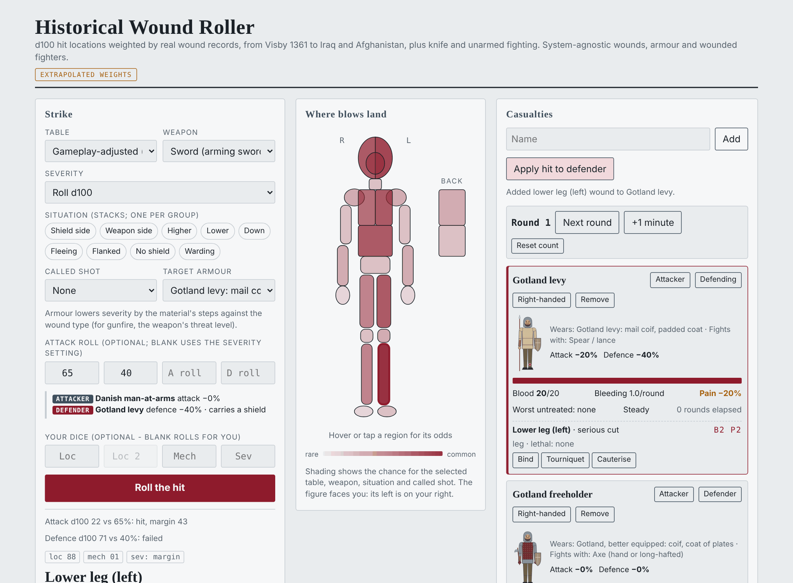
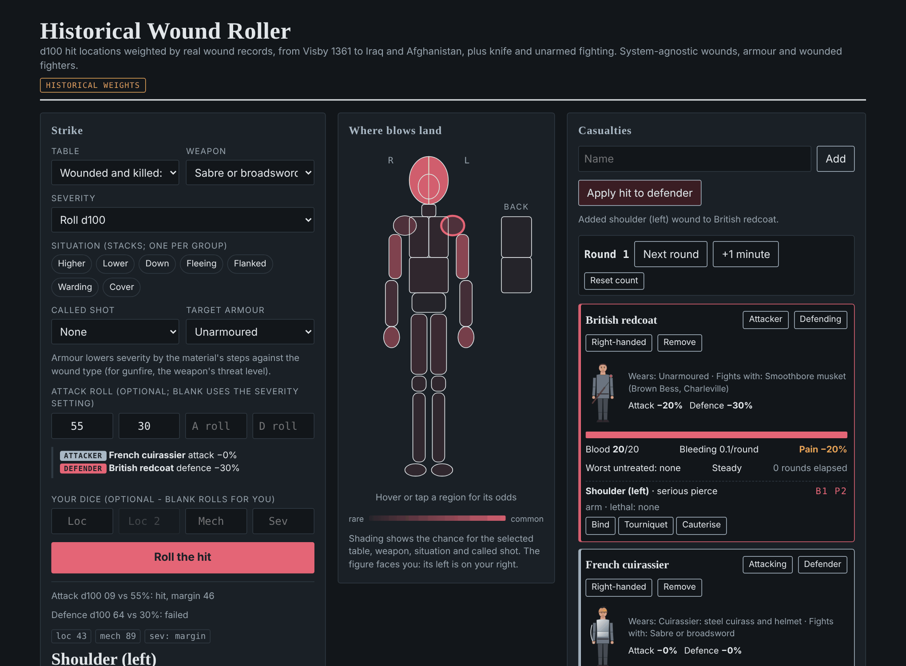
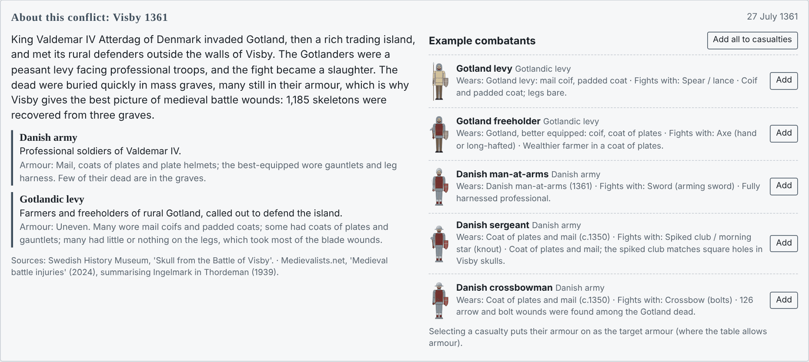
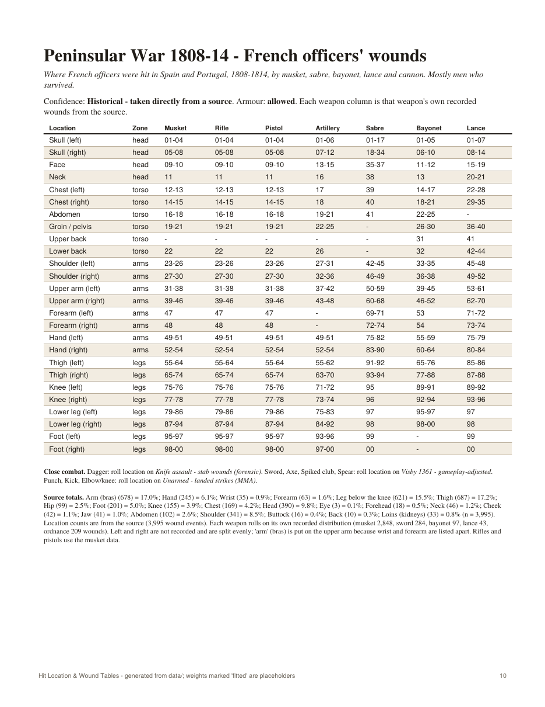

# HitLoc reference (inherited)

> This is HitLoc's README as of the copy into Grave Wounds (HitLoc PR #14), with commands and paths updated to the `gravewounds` package. It documents the inherited data, roller and command line. Parts will be rewritten or pruned as Grave Wounds diverges. HitLoc itself lives at <https://github.com/swares/HitLoc>.


Data-driven **d100 hit-location tables** weighted by real wound records - from the
crusader mass graves at Sidon (13th century), the Visby skeletons of 1361, Towton (1461) and the Thirty Years' War through the American Revolution, the Napoleonic Wars and the War of 1812, the Civil
War and the Indian Wars to both World Wars, Korea, Vietnam, Iraq and Afghanistan - with
**system-agnostic wound effects**, armour, and wounded-fighter tracking for any tabletop
RPG. All outputs are generated from the YAML files in `data/`, so the printed tables and
the web roller never drift apart.

**Try it online: <https://swares.github.io/HitLoc/>** (start page, then *Open the roller*).



**Features**
- 33 hit-location tables, down to locations like *left forearm*, each
  tagged with how directly it comes from the source (historical, fitted, extrapolated).
- Weapons by era (sword, axe, spiked club, bow, crossbow, sling, musket, sabre, lance,
  bayonet, rifles, machine guns, grenades, mines, IEDs...) with their own wound mechanisms.
- Situations that stack (higher ground, fleeing, flanked, behind cover, no shield...)
  and called shots.
- Armour from mail and coats of plates to steel cuirasses, flak vests, Kevlar and
  rifle plates, resolved per location with partial coverage.
- Wound effects: bleeding, pain, impairment, time to death untreated, infection; a
  casualty tracker with blood loss, treatment, and penalties that feed an optional
  attack and defence roll.
- A history page for every war: who fought, how each side used armour, and ready-made
  example combatants, each drawn as a small figure in their armour, with a typical weapon
  and their side's colours; casualty cards mark wounds on the figure.
- A self-contained web roller, a 124-page printable PDF, Markdown tables, a Python CLI,
  and a JSON data bundle.

<details>
<summary>More screenshots</summary>

Dark mode, Peninsular War table: a French cuirassier's sabre cuts a British redcoat's
right hand, so he now fights off-hand.



Every war has a history panel with sides, armour use and example combatants to add.



One page of the printable tables (`dist/tables.pdf`): each weapon column is that
weapon's own recorded wounds.



</details>

## Start in the browser (no install)

Online: open <https://swares.github.io/HitLoc/> and press **Open the roller**. Offline:
open `dist/roller.html` in any modern browser: double-click it, or drag it onto a browser
window. Everything is inside that one file, so it works offline and needs no server or
Python. (Only the fonts load from the web; without a connection it falls back to system
fonts.) The same page is also published as a private Claude artifact, "Historical Wound
Roller", which you can open from your Claude artifacts and share from its Share menu.

Quick start:
1. **Table** - pick the fight (grouped by war) and **Weapon**.
2. Optional: **Situation** chips (they stack, one per group), **Called shot**, **Target
   armour**, and an **Attack roll** (attacker %, defender %, and your own dice if you like).
3. Press **Roll the hit** for location, wound type, severity and effects; the body figure
   shades where hits land on the chosen table.
4. **Casualties**: add a name or load the war's example combatants (in *About this
   conflict*), mark one **Attacker** and one **Defender**, then **Apply hit to defender**.
   Press **Next round** (or **+1 minute** for ten rounds) to move the whole group on: everyone
   bleeds, the round counter goes up, and a short log says who lost how much Blood and who
   passed a threshold (pale and weak, faint, down, unconscious). **Reset count** starts the
   count again without healing anyone. Bind / Tourniquet / Cauterise treat wounds; wound
   penalties feed into the attack roll automatically.
5. **Turn order** (optional): give each fighter an **Init** number from your game (reaction,
   speed, an initiative roll). The list sorts highest first; fighters with the same number
   keep the order you set by dragging the ⋮⋮ grip or using ▲ ▼ (a fighter can't be moved
   past a different number; change the number instead). **Next fighter** marks the next
   fighter who is still up as **Acting** and makes them the attacker, skipping anyone down
   or unconscious (a fighter knocked out while attacking stops being the attacker); after
   the last one the round ends (as Next round) and it starts again at
   the top. Initiative stays the same each round and can be edited at any time. Wounds
   don't change the order: the slowing they would cause (the same penalty as on attack)
   is shown beside the number, for you to apply if your system does.

The roller warns when combatants come from different wars (a weapon not used in that
fight, or armour the table already accounts for) and offers a one-click switch. Casualties
are kept in that browser between visits.

The printable version of every table is `dist/tables.pdf` (`dist/tables.md` as Markdown).

## Layout

```
data/
  body.yaml            26-location body map (zone, side, wound class, armour slot)
  weapons.yaml         weapons: wound mechanism mix, gunfire threat level, close-combat kind,
                       location bias; melee_everywhere + melee_fallback
  wounds.yaml          severity tiers, effect vocabulary, mechanism rules,
                       location-class profiles, survival tracking rules
  tables/*.yaml        one file per hit-location table (battle / context)
  sources/*.csv        case-by-case tallies behind a table (e.g. the 1865-71 arrow wounds)
  modifiers.yaml       situation modifiers (stack by multiplying weights) + called-shot rule
  conflicts.yaml       history per table group: period, summary, sides and how each used
                       armour, example combatants (armour kit + weapon), sources
  armor.yaml           armour materials (steps by mechanism and gunfire threat) and kits
                       (medieval, Visby, modern) by slot, with layered d100 coverage
gravewounds/                engine: validation, d100 ranges, wound composition, CLI
tools/blend_tables.py  writes the musket-era all-hits blends
tools/maps/            builds data/maps.json (conflict locator maps) with Node
templates/roller.html  web roller template (data is injected at build)
build.py               builds dist/
dist/
  tables.pdf           printable tables
  tables.md            same tables as Markdown
  roller.html          self-contained web roller with wound tracker
  gravewounds-data.json     compiled data bundle (for other tools)
index.html             start page for GitHub Pages (generated by build.py)
.nojekyll              tells GitHub Pages to serve files as they are
.sonarcloud.properties keeps generated files (index.html, dist/) out of code analysis
docs/screenshots/      images used in this README and the start page
requirements.txt       Python packages (PyYAML; reportlab for the PDF; Playwright, optional,
                       to draw the combatant figures into the PDF)
templates/figure.js    combatant figures (SVG) from kit, weapon and look
```

## Combatant figures

Every example combatant, and every casualty in the tracker, is drawn as a small flat
figure by `templates/figure.js`, entirely from the data:

- **Armour** - the kit's slots and coverage (`armor.yaml`), one look per material (mail
  rings, quilted padding, coat of plates, steel, buff coat, flak vest, Kevlar, plate
  carrier). Partial coverage is drawn as that share of the body part: a visual shorthand
  for "that share of hits there meet armour". A kit can name its helmet shape
  (`look: {helmet: bascinet}`); otherwise the helm slot's material decides.
- **Weapon** - each weapon's `icon` in `weapons.yaml`.
- **Look** - `look:` on a side in `conflicts.yaml` (colours and headgear for the whole
  side), merged with an example's own `look:`: `colour` (coat), `trousers`, `coat: skin`
  (bare chest), `hat` (drawn when the kit has no helmet), `helmet` (shape, when it has
  one), `beard` (moustache, beard, stubble), `shield` (heater or round, when the kit has one).
- **Wounds** - on casualty cards, a red mark per open wound (bigger for worse wounds; a
  dashed ring for the back, which the front view can't show).

The names the figures know are listed in `gravewounds/model.py` (`FIG_NAMES`); the check
rejects anything else, and the build checks that `figure.js` draws them all. The PDF's
example tables include the figures when Playwright and Chromium are installed (the build
draws them with a headless browser); without them the PDF is built without figures. The
figures are illustrations, not research: dress and colours are typical, not exact.

### Period pictures

82 of the 115 example combatants link to a period picture of such a fighter on Wikimedia
Commons: a painting, uniform plate, wartime photograph or surviving armour (the "picture"
link next to the name in the roller, "(picture)" under the name in the PDF, a Picture
column in `tables.md`). The rules:

- **Commons only**, as `image: {file, caption}` on the example in `conflicts.yaml`. The
  file is the Commons file name, so every link goes to its Commons page, which shows the
  licence and origin. The check rejects URLs and anything that isn't an image file name.
- **Period only.** Art, photographs or objects from the time; no reenactors and no later
  reconstructions. Where the nearest period image is not an exact match, the caption says
  so: Brunswick rather than Hessian troops in America, Morier's grenadiers of 1751, Catlin's
  Comanche of 1834, prints of the Thames made in 1833, Froissart's Crécy crossbowmen.
- **No picture rather than a weak one.** 24 examples (and the 9 generic ones under
  Reference, Close combat and Unarmed) have none: no suitable period image was found
  (a crusader crossbowman and townsman, the Finnish hakkapeliitta, Croat horsemen, a Towton billman, Loyalist rangers, the Canadian militia,
  North Korean and Vietnamese fighters), or the images available show the dead,
  prisoners or propaganda, which this project doesn't link.

Links were checked when added. Commons pages are stable, but files are sometimes
renamed; a renamed file still redirects, a deleted one doesn't.

## Conflict maps

Each war has a small locator map (in *About this conflict*, on the start page, and on its
PDF history page): the region at medium detail, with a dot for each place the records come
from (Visby, Lützen, the Peninsula's battles, Bougainville and Italy, Mogadishu...). Wars
fought within today's borders (Korea onward) also show faint modern borders and shade the
theatre countries; older wars show coastlines only, since modern borders would be wrong
for them. Nearby sites share one dot; hover a dot for its names.

A solid dot is a place the wound records come from. A hollow dot is a place fought over in
that war that the records do not cover. The War of 1812 map, for example, has only hollow
dots (Queenston Heights, Lundy's Lane, Baltimore, New Orleans and others), since no
region-by-region wound count survives for that war and its table borrows the Peninsular
records. The Great Lakes and other large lakes are drawn as water.

- The map spec is data: `map:` on each conflict in `conflicts.yaml` (`bbox`, `sites`,
  optional `borders` and `highlight`; a site with `context: true` gets a hollow dot). A
  list of specs, each with a `label`, draws several panels side by side (stacked on the
  start page).
- `tools/maps/make_maps.mjs` turns the specs into `data/maps.json` (plain SVG paths)
  from Natural Earth coastlines and borders (public domain, via the `world-atlas` npm
  package) and Natural Earth lakes (via the `sane-topojson` package, MIT): `cd tools/maps && npm ci && node make_maps.mjs`. Node is needed only
  for this step; the build warns when a map is missing or out of date.

## Website (GitHub Pages)

`build.py` also writes `index.html`, the start page: an *Open the roller* button,
downloads (PDF, Markdown, JSON), counts of tables, wars and weapons, and the list of
what's covered, all generated from the data so it never drifts. GitHub Pages serves the
repository root, so pushing a rebuilt `dist/` and `index.html` to `main` updates the site.

One-time setup on GitHub: **Settings -> Pages -> Build and deployment -> Deploy from a
branch -> `main` / `(root)`**, then put `https://swares.github.io/HitLoc/` in the repo's
About -> Website.

## Command line (Python)

```
pip install -r requirements.txt
python build.py                                   # rebuild everything in dist/
python -m gravewounds check                            # validate data
python -m gravewounds list
python -m gravewounds show --table visby-1361-evidence --weapon axe
python -m gravewounds roll --table visby-1361-adjusted --weapon sword -n 3
python -m gravewounds roll --table visby-1361-adjusted --weapon spear --severity serious
python -m gravewounds roll --table visby-1361-adjusted --weapon spiked_club \
       --mod flanked --mod target_down --called head --armor danish_maa
python -m gravewounds show --table visby-1361-adjusted --weapon axe --mod target_fleeing
python -m gravewounds roll --table visby-1361-adjusted --weapon axe --attack 65 --defence 40 \
       --att-penalty 20 --def-penalty 10 --armor gotland_levy
```

## Roll procedure

1. d100 location: table for the fight, column for the weapon. Situations reshape the
   table (they stack in the roller/CLI; printed pages show one at a time).
   Called shot: roll twice, keep the result in the called zone (else the first).
2. d100 mechanism for the weapon (cut / pierce / crush).
3. Severity from your system's damage, or d100 (01-55 light, 56-85 serious, 86-00 critical).
   Ballistic hits roll on their own table by zone (head/torso 01-25 / 26-62 / 63-00;
   limbs 01-55 / 56-90 / 91-00), calibrated to Bougainville 1944 lethality.
4. Armour (tables marked armour allowed): find the slot's layer (d100 bands, e.g. plate
   01-65 / soft Kevlar 66-00, above the last band is a gap), lower severity by that
   material's steps against the mechanism - for gunfire, against the weapon's threat
   (fragment, pistol, rifle, AP rifle) - minus the weapon's armour defeat.
   Below Light = stopped (bruise).
5. Wound = location class profile at that severity, then the mechanism's rules.

## Fighting while wounded (optional attack roll)

`wounds.yaml` `combat:` holds the rules, used by `gravewounds/combat.py`, the CLI and the roller:
- Each fighter's wounds give attack and defence penalties: pain (10% a step), blood loss
  (10 / 20 / 40%), and impairments (dazed, vision, leg, arm...). Arm impairments count
  against the weapon arm or the shield arm by the fighter's weapon hand (default right).
  They add up, each total capped at 60%.
- Attack: d100 under attack % minus penalties; margin = effective chance minus roll; a
  roll at or under a tenth of the effective chance is a critical and cannot be defended.
  Defence: d100 under defence % minus penalties avoids the blow.
- On a hit the margin sets severity (default: serious at 20+, critical at 50+; firearms
  and explosives: head/torso 10+ / 35+, limbs 30+ / 60+). The firearm bands reproduce the
  Bougainville-calibrated severity mix at about 60% attack chance; better shots wound worse.
- Wounds switch situations on: defender cannot stand = Target down; shield arm useless =
  No shield; attacker on the ground = Attacker lower.

In the roller, mark a casualty as Attacker and another as Defender; the attacker's weapon
and the defender's armour are filled in, penalties apply to the attack roll, and Apply hit
adds the wound to the defender. Leave the attack % blank to use your own system's roll.

## Weapons by conflict and close combat

Each table lists the weapons of its fight. Close-combat weapons (dagger, bayonet, sword,
axe, spiked club, spear, punch, kick, elbow/knee) are offered on every table; on a table of another kind of fighting
they roll location on the era's melee table (`melee_fallback`: knives on the
knife-assault table, unarmed strikes on the MMA table). A weapon can name its own
`melee_table`:
- the bayonet, sabre and cavalry lance roll on the Peninsular War table, which records
  where 97 bayonet, 284 sword and 43 lance wounds fell. Edged weapons rarely killed there
  (8 deaths in 424 casualties), so survivors' records show nearly every edged hit;
- the sharpened entrenching tool and the clubbed musket roll on the Visby gameplay-adjusted
  table (chops and blows), with `fallback_mods: [no_shield]` applied automatically because
  their users carry no shield. No wound-location data exists for either;
- the bill and poleaxe roll on the Towton gameplay-adjusted table.

A table's `native` says what its own data is (armed, unarmed or gunfire; gunfire covers
any shooting, arrows included); `also_native` adds further kinds, e.g. the Peninsular table
records gunfire and edged weapons (`native: gunfire`, `also_native: [armed]`).

`weapon_bias` decides how weapon location biases apply on a table:
- `raw` - as written (melee tables, the baseline);
- `recentred` - each weapon keeps its shape (mines hit legs) but a per-location
  correction makes the source's `weapon_mix` average back to the published totals
  exactly (checked to 1e-12);
- `pooled` - all weapons share the source odds (no mix in the source to re-centre on);
- `sourced` - the source gives each weapon its own location counts (`weapon_regions`,
  same format as `regions`); each weapon rolls on its own data, and weapons without any
  use the pooled odds.

Firearms and explosives (any weapon with a `threat`) roll severity on the firearm table.

## Bows, crossbows and slings

- **Bow** - its own table is *Indian Wars 1865-71 - arrow wounds*, tallied wound by wound
  from the US Army's 1871 surgical report (83 cases, 122 located arrow wounds;
  `data/sources/indian-wars-arrows-1865-71.csv`). Half the hits were in the trunk and only
  9% in the legs: unarmoured men, many mounted, shot at close range. Also offered on both
  Visby tables (126 arrow and bolt wounds there fell, like blade wounds, mostly on the lower
  body, so the Visby weights are used unchanged) and on the random-hit baseline.
- **Longbow** - Towton tables. On the evidence table it uses all the recorded wounds
  together (bone evidence under-counts arrows, which mostly wounded soft tissue); ignores 1
  armour step against pierce (design estimate).
- **Crossbow** - Visby tables and baseline; small head bias and ignores 1 armour step
  against pierce (design estimates). Visby does not count bolts apart from arrows.
- **Sling** - Visby gameplay-adjusted table and baseline; crush wounds, head bias (design
  estimate). No battlefield tally separates sling wounds.
- Arrows and bolts are pierce wounds, not gunfire: they roll severity on the default tiers.
  Check: on the arrow table, 32% of bow hits are fatal untreated (lethal in days or less);
  the report gives 26 deaths in 83 cases (31%), many of them men hit several times.

## Crusades (Sidon, 13th century)

- *Sidon - crusader mass graves*: bones of at least 25 men killed when crusader Sidon was
  sacked, in 1253 by an army from Damascus or in 1260 by the Mongols (Mikulski et al., PLoS
  ONE 2021, open access). From the study's S1 Table: 100 bones with definite battle injuries
  by body region (62 sharp, 35 blunt, 5 penetrating; `data/sources/sidon-1253-mass-graves.csv`).
  Sides are not recorded. Swords and axes roll on the sharp-force bones, the mace on the
  blunt and the spear on the penetrating. 24 of the 100 bones are blade cuts across the back
  of the neck, which the authors think may be executions of captives: kept in the evidence
  table, left out of the gameplay table.
- *Gameplay-adjusted* table: neck cuts removed, trunk raised to 30% (design estimates).
- Figures: shields can be `heater` (default) or `round` (`look: {shield: round}`).

## Wars of the Roses (Towton 1461)

- *Towton 1461 - mass grave*: death wounds on the men buried at Towton Hall, most likely
  Lancastrians cut down in the rout (Holst and Sutherland 2014, "Towton Revisited", in
  Eickhoff and Schopper (eds), *Schlachtfeld und Massengrab*, pp. 97-129). Transcribed wound
  by wound from the chapter's Tab. 12 (124 head wounds on 31 skulls: 79 blade, 32 blunt, 13
  penetrating) and Tab. 9 (56 injured bones below the head, mostly hands and forearms, and
  9 neck vertebrae) into `data/sources/towton-1461-mass-grave.csv`. Head wounds are counted
  per wound and body injuries per bone, as published. Blades roll on the blade wounds, the
  poleaxe on the blunt ones and the dagger on the penetrating ones. The chapter's text
  percentages imply about 132 head wounds; its table lists 124, which the table follows.
- *Gameplay-adjusted* table: the bone evidence (74% head and neck, almost no trunk)
  re-weighted by stated corrections, as for Visby: trunk raised to 30%, head and neck
  lowered to 31%, legs raised to 18% (design estimates).
- New weapons: bill, poleaxe, longbow. New kits: jack and sallet (archer or billman),
  brigandine and sallet (retainer); the man-at-arms uses the full plate kit (c.1450). New
  material: jack (many layers of linen; design estimate). The figures draw the jack in the
  side's livery colour.

## Thirty Years' War (pike and shot)

- *Lützen 1632 - mass grave*: battle injuries on 47 men buried together, most likely the
  Swedish Blue Brigade caught by imperial cavalry (Nicklisch et al., PLoS ONE 2017, open
  access). 69 reliable injuries with sides recorded: 32 from lead balls (22 to the skull),
  21 blunt, 16 sharp; each weapon rolls on its own mechanism's injuries
  (`data/sources/lutzen-1632-mass-grave.csv`). Killed only, bone only: the trunk is
  under-counted and the head dominates (69% of gunshot hits).
- *All hits* blend (estimated): 25.5% the Lützen dead + 74.5% the Peninsular wounded as a
  stand-in (no wounded records survive for this war).
- Weapons: matchlock musket, wheellock pistol or carbine. Armour: cuirassier
  (three-quarter plate), harquebusier (buff coat, breastplate, pot helmet), pikeman
  (morion and corslet); new material: buff coat.

## Musket era: American Revolution, Napoleonic Wars, War of 1812

- **American Revolution** - *disabled veterans' wounds*, tallied wound by wound from the
  federal invalid pension lists of 1792-95 (344 men, 379 located wounds;
  `data/sources/revolution-invalid-pensions-1792-95.csv`). Survivors only. Plus an
  *all hits* blend (see below).
- **Napoleonic Wars** - *Peninsular War 1808-14, French officers' wounds* (3,995 wound
  events, with separate counts for musket, artillery, sword, bayonet and lance), plus an
  *all hits* blend.
- **War of 1812** - its own period, with its sides, examples and map, and an *all hits*
  table. No region count survives for this war, so the table is built from the Peninsular
  records (same weapons and tactics; many British regulars were Peninsular veterans) at
  the war's own killed share. Leave armour off.
- **All-hits blends (estimated)** - `tools/blend_tables.py` mixes each wounded table with
  the Civil War killed-in-action table (soft lead balls too) as a stand-in for the dead:
  46.5% killed for the Revolution (Peckham: 7,174 killed, 8,241 wounded), 25.5% for the
  Napoleonic Wars (about 3,500 killed to 10,200 wounded in Wellington's army at Waterloo)
  and 33.4% for the War of 1812 (US forces: about 2,260 killed in action, 4,505 wounded).
  Edit the shares there and re-run it.
- New weapons: smoothbore musket, flintlock rifle and pistol, smoothbore artillery, cavalry
  lance, clubbed musket. New armour: steel cuirass and cavalry helmet (kits: cuirassier,
  dragoon helmet).

## Mixing combatants from different wars

- Any close-combat weapon works on any table: medieval weapons, the spade and the clubbed
  musket roll on the Visby gameplay-adjusted table; the bayonet, sabre and lance on the
  Peninsular table; knives on the knife-assault table;
  unarmed strikes on the MMA table. A weapon uses the current table only if the table
  lists it and records that kind of fighting.
- Shields: kits carry a `shield` flag. On a table that `assumes_shield` (Visby), a chosen
  defender without a shield gets No shield automatically (CLI: `--shield kit|yes|no`). In the roller,
  changing Target armour while a defender is selected puts that kit on the defender, shield
  included.
- Armour counts only on armour-allowed tables. The roller warns when the defender's armour
  is being ignored, or when the attacker's weapon isn't used in the chosen fight, and
  offers a one-click switch (the war's all-hits table, the random-hit baseline, or a table
  that has the weapon).
- Hit locations always come from the chosen table: a knight shot on the Bougainville table
  is hit like a WWII soldier in a jungle firefight.

## Evidence vs adjusted

- **Evidence** tables = where wounds were recorded. Armour the source population wore is
  already reflected (`armor: baked_in`); don't apply armour again.
- **Armour allowed** (`armor: allowed`): adjusted and all-hits tables, the random-hit
  baseline, the knife-assault and unarmed tables. Resolve armour per location slot.

## Adding things (no code changes)

- **New battle / context:** copy a file in `data/tables/`, change `id`, `name`,
  `weapons`, `weights` (any scale; they're normalised to 100), `sources`, `confidence`.
- **New weapon:** add an entry to `weapons.yaml` with `mechanisms` summing to 100
  and optional `zone_bias` / `loc_bias`; list its id in the tables that use it.
- **New situation:** add to `modifiers.yaml` with `zone` / `side` / `loc` multipliers
  (and `group` if it excludes others).
- **New armour:** add a material to `armor.yaml` (steps 0-3 per mechanism) or a kit
  mapping slots to materials (`{material: x, cover: N}` for partial coverage).
- **New mechanism or location class:** add to `wounds.yaml` (and `body.yaml`).
- **New conflict history:** add an entry to `conflicts.yaml` under the tables' `battle`
  name, with `sides` and `examples` (kit and weapon ids). The check warns about a table
  group without history and an example carrying a weapon its tables don't offer; mark
  such an example `elsewhere: true` when that is deliberate (a US trooper's revolver in
  the Indian Wars rolls on a Civil War table).
- Run `python -m gravewounds check`, then `python build.py`.

Locations whose weight rounds to 0% are left off that d100 column.

## Confidence tags

- `historical` - taken directly from a source
- `fitted` - estimated to match published summary figures
- `extrapolated` - design estimate from analogous evidence

## Tables

| Table | Variant | Confidence | Source |
|---|---|---|---|
| Visby 1361 - bone evidence | evidence | fitted | Ingelmark summaries (placeholder for per-bone counts) |
| Visby 1361 - gameplay-adjusted | adjusted | extrapolated | derived from the evidence table |
| Sidon - crusader mass graves | evidence | historical (per weapon) | Mikulski et al., PLoS ONE 2021, S1 Table: 100 bones, about 25 men |
| Sidon - gameplay-adjusted | adjusted | extrapolated | derived from the evidence table, neck cuts left out |
| Towton 1461 - mass grave | evidence | historical (per weapon) | Holst and Sutherland 2014, Tab. 9 and 12: 124 head wounds, 56 bones |
| Towton 1461 - gameplay-adjusted | adjusted | extrapolated | derived from the evidence table |
| Lützen 1632 - mass grave | evidence, armour allowed | historical (per weapon) | Nicklisch et al., PLoS ONE 2017, 47 men, 69 injuries |
| Thirty Years' War - all hits | adjusted | extrapolated | 74.5% Peninsular wounded + 25.5% Lützen killed |
| American Revolution - disabled veterans' wounds | evidence, armour allowed | historical (regions; sides pooled) | Federal invalid pension lists 1792-95 (MEAD dataset, Penn 2021), 344 men |
| American Revolution - all hits | adjusted | extrapolated | 53.5% pension table + 46.5% Civil War killed (Peckham's killed:wounded) |
| Peninsular War 1808-14 - French officers | evidence, armour allowed | historical (per weapon) | Planas Campos & Grajal de Blas, BJMH 2021, 3,995 wound events |
| Napoleonic era - all hits | adjusted | extrapolated | 74.5% Peninsular + 25.5% Civil War killed (Waterloo killed:wounded) |
| War of 1812 - all hits | adjusted | extrapolated (borrowed) | 66.6% Peninsular + 33.4% Civil War killed (US killed:wounded); no 1812 wound count survives |
| Civil War - wounded | evidence | historical (regions) | Medical and Surgical History of the War of the Rebellion, vol. 3 |
| Civil War - killed in action | evidence | historical (regions) | same work, 1,173 KIA |
| Civil War - all hits | adjusted | extrapolated | 4:1 blend of wounded and killed |
| Indian Wars 1865-71 - arrow wounds | evidence, armour allowed | historical (regions; sides pooled) | US Surgeon General, Circular No. 3 (1871), 'Arrow-Wounds', 83 cases |
| WWII Italy 1944 - killed | evidence | historical (regions) | Wound Ballistics in WWII, ch. 6, Table 118 |
| Bougainville 1944 - wounded / killed / all hits | evidence, evidence, adjusted | historical (regions) | Oughterson et al. wound ballistics study, 1,456 hits |
| Iraq & Afghanistan 2001-05 | evidence | historical (regions) | Owens et al., J Trauma 2008 (6,609 wounds); J Orthop Trauma 2007 |
| WWI 1914-18 | evidence | historical (regions) | Borden Institute, Weapons Effects and War Wounds, Table 1-2 |
| Korea 1950-53 / Vietnam 1965-70 - hospitalized | evidence | historical (regions) | Neel, Medical Support of the US Army in Vietnam (1973), Table 7 |
| Northern Ireland, Falklands 1982, Gulf War 1991 (US, UK), Somalia 1993, Chechnya | evidence | historical (regions) | Borden Institute, Table 1-2 |
| Owens comparison set: WWII, Korea, Vietnam, Iraq & Afghanistan (one table filed under each war) | evidence | historical (regions) | Owens et al., J Trauma 2008 comparison table - one counting rule, one extremity split, gunshot/explosion mix; side-by-side on the Reference page |
| Baseline - random hit | evidence | fitted | body surface area (same Owens table; rule of nines for limbs) |
| Knife assault (Stockholm homicides 1983-93) | evidence, armour allowed | historical (regions) | Karlsson 1998, Forensic Sci Int |
| Unarmed - MMA landed strikes | evidence | historical (head/body/legs) | Fightshow UFC Strike Map, 648,783 strikes |

A table can give `weights` per location, or `regions` (a source's coarse totals as
`pct`, e.g. "upper extremities 35.6%", or raw case numbers as `count`), which are split across locations by `exposure` in
body.yaml or by an explicit `split`. `modifiers:` lists the situations a table offers;
`order:` sets its place in lists; `battle` groups it and `label` names it in the roller's picker (labels must be unique within a group). `excluded_pct` records a share the source could not
place (e.g. "other/multiple 22%"), which is left out before normalising. `weapon_mix`
(labels with pct) prints a d100 "what hit them?" table from the source's cause-of-injury
figures. Weapons with identical location bias share one situation page in the PDF.

## Data status

The musket-era tables are survivors' records: pensioners disabled for life, and French
officers of whom 95% survived. Their all-hits blends borrow the Civil War dead for where
fatal hits landed, and the killed shares come from casualty totals; both are estimates.

The Towton tables come from one grave of men killed in a rout, many probably after they
had fallen or lost their helmets; they show where men were wounded in that rout, not in
the fighting line. **Wittstock 1636** (Thirty Years' War, 125 dead, 88 complete skeletons
examined) is pending: its trauma analysis (Jungklaus, König and Wahl, in the same
*Schlachtfeld und Massengrab* volume, pp. 285-304) is in print only and was not available
for this project.

The arrow table is a collection of case reports, not a census: dramatic skull and trunk
cases were more likely to be written up. Its 40 cases from routine casualty lists (none
fatal) are less biased and still put 40% of wounds in the trunk. Left and right are pooled
(small sample); feet round to 0%.

The Visby evidence table is **fitted** to published summaries (1,185 individuals;
456 cut wounds; head-wound rates per grave; legs, arms and skulls dominant, torso
protected). It is a placeholder for the per-bone counts in Ingelmark, "The Skeletons",
ch. IV of Thordeman, *Armour from the Battle of Wisby 1361*, vol. I (1939), p. 149ff.
Ballistic wound lethality is calibrated to Bougainville 1944 (share of hits that killed,
by region): model vs study - head 33.6 / 37.5%, chest 38.0 / 37.7%, abdomen 38.0 / 42.1%,
arms 0.0 / 0.3%, legs 3.8 / 3.4%, overall 19.3 / 20.2% (gunshot only). With the
Bougainville weapon mix, where explosions also cause crush wounds: head 31.0 / 37.5%,
chest 37.0 / 37.7%, abdomen 35.1 / 42.1%, arms 0.3 / 0.3%, legs 3.8 / 3.4%,
overall 18.2 / 20.2%.

Weapon biases, situation multipliers, armour protection steps and wound profiles are
design estimates (tagged `extrapolated`). The roller recomputes d100 ranges in JavaScript
with the same algorithm and the same precomputed weapon multipliers as the Python engine;
parity was checked over 5,000 table/weapon/situation/shield cases (half on the musket-era
tables), and armour steps over every material x mechanism x weapon (2,448 cases). The d100
rounding sums weights left to right in both languages (Python 3.12+'s compensated `sum()`
could otherwise break an exact tie differently from the browser). Combat rules were checked the same way:
1,500 random wound sets for penalties, 1,500 margin-severity and 1,500 attack-roll cases.
